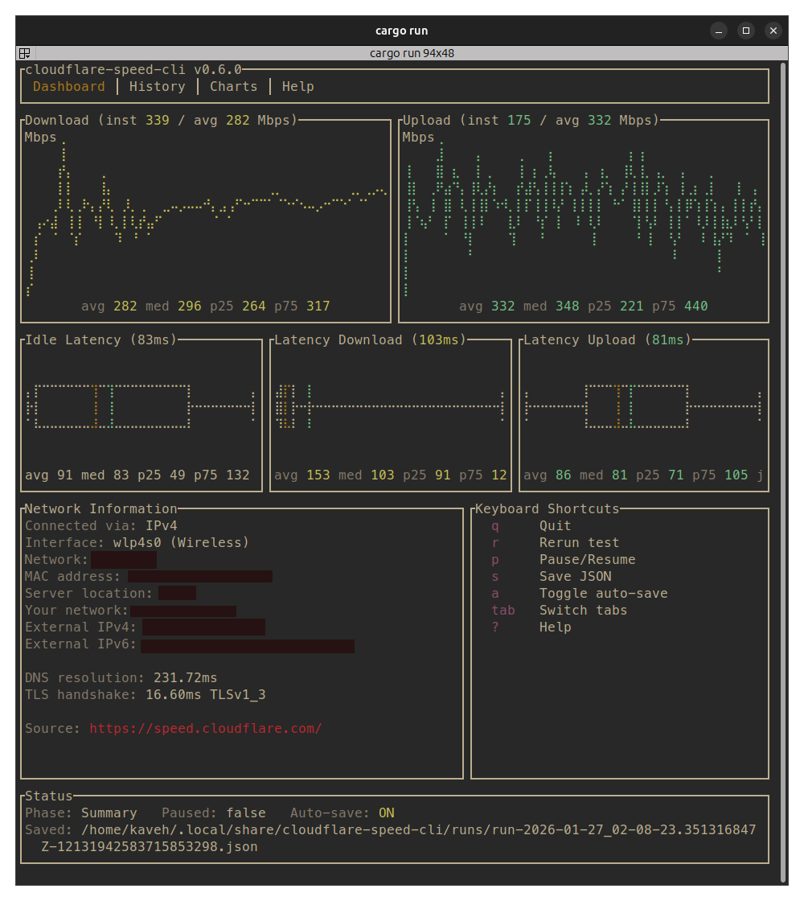
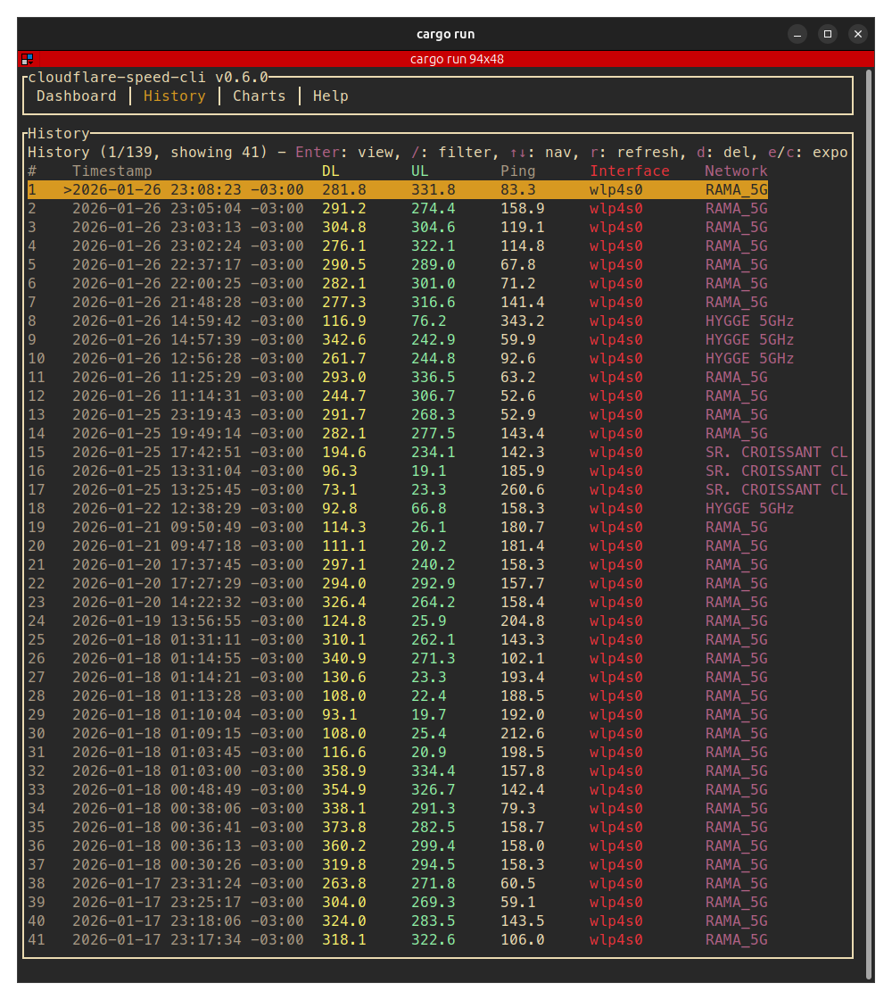
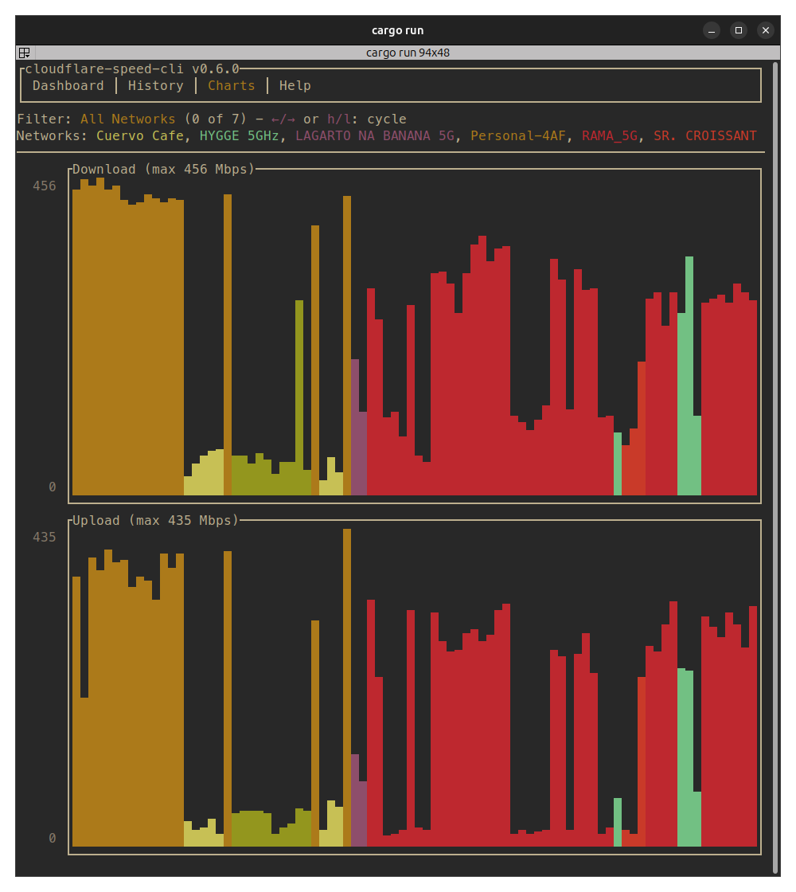

# cloudflare-speed-cli

[](https://www.rust-lang.org/)
[](LICENSE)

A CLI tool that displays network speed test results from Cloudflare's speed test service in a TUI interface.

> [!WARNING]
> If you're seeing zero download speeds, a hotfix has been implemented in v0.6.2. If you are on a version before this, upgrade by following the [installation instructions](#installation) below.





## Features

- **Speed Tests**: Measures download/upload throughput, idle latency, and loaded latency
- **Interactive TUI**: Real-time charts and statistics
- **History**: View and manage past test results
- **Export**: Save results as JSON
- **Text/JSON Modes**: Headless operation for scripting
- **Interface Binding**: Bind to specific network interface or source IP

## Installation

### From Source

My preferred way if you have cargo installed:

```bash
cargo install --git https://github.com/kavehtehrani/cloudflare-speed-cli --features tui
```

### Homebrew

This works for both older Intel and newer Silicon Mac computers.

```bash
brew tap kavehtehrani/tap
brew install cloudflare-speed-cli
```

### Installation Script

For the lazy:

```bash
curl -fsSL https://raw.githubusercontent.com/kavehtehrani/cloudflare-speed-cli/main/install.sh | sh
```

### Linux Distribution Packages

As other people have kindly contributed, I've merged their pull requests for the distro they have
contributed toward. My main OS is Ubuntu and Fedora, and the main distribution mechanism for this package is via
['cargo-dist'](https://github.com/axodotdev/cargo-dist) which I have found helpful in generating the compatible binaries
via github actions. If you would like to contribute for other distros, please open an issue or send in a pull request.

#### Arch Linux

The package can be installed from the [official repositories](https://archlinux.org/packages/extra/x86_64/cloudflare-speed-cli/):

```bash
pacman -S cloudflare-speed-cli
```

#### NixOS

```bash
 nix run github:kavehtehrani/cloudflare-speed-cli
```

### Binaries

Download the static binary for your system from the
[latest release](https://github.com/kavehtehrani/cloudflare-speed-cli/releases).

_Note: I have checked the binaries on Linux (x64 and ARM64) and on Windows 11 but I do not have an Apple device. If there is any issue please do let me know!_

## Usage

Run with the TUI (default):

```bash
cloudflare-speed-cli
```

Text output mode:

```bash
cloudflare-speed-cli --text
```

To see all options:

```bash
cloudflare-speed-cli --help
```

## Source

Uses endpoints from [speed.cloudflare.com](https://speed.cloudflare.com/)
You can read more about how Cloudflare's speedtest works [here](https://speed.cloudflare.com/about/).

## Outstanding Issues

- Network information on Windows is incomplete. I haven't used Windows (outside gaming) in many years and unless there's demand for it I likely won't implement this part. Feel free to open a PR or an issue and we can chat. Honestly the only reason there's a Windows binary at all is because ['cargo-dist'](https://github.com/axodotdev/cargo-dist) made it so easy to do so.

## Contributing

Contributions and comments are very welcome! Please feel free to open issues or pull requests.
